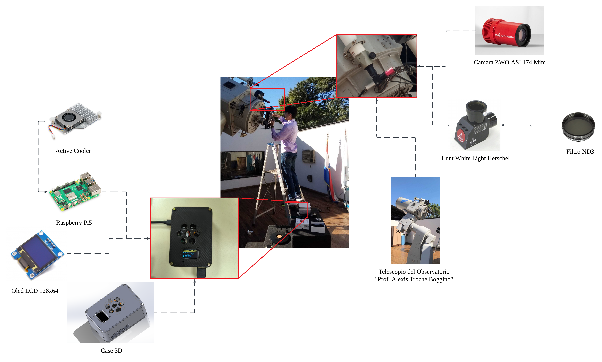
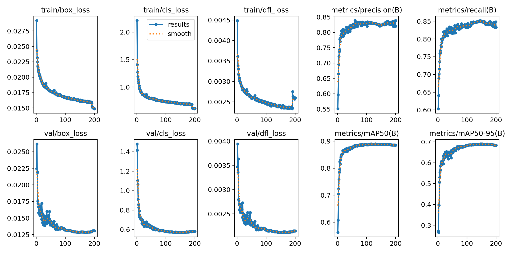
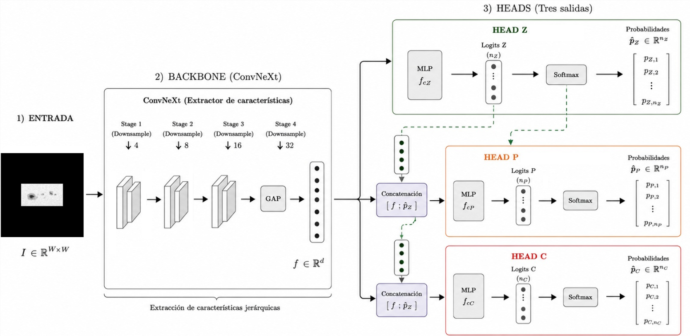
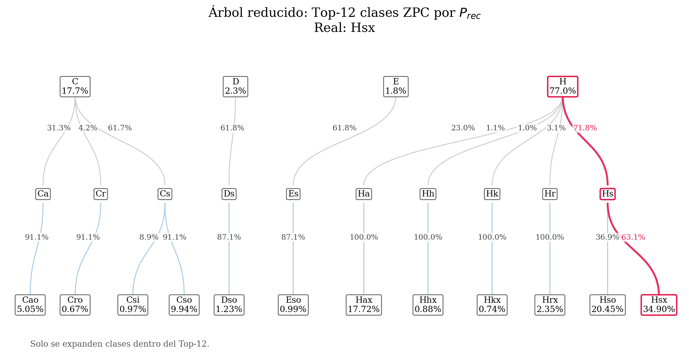
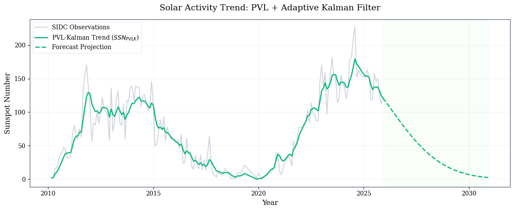
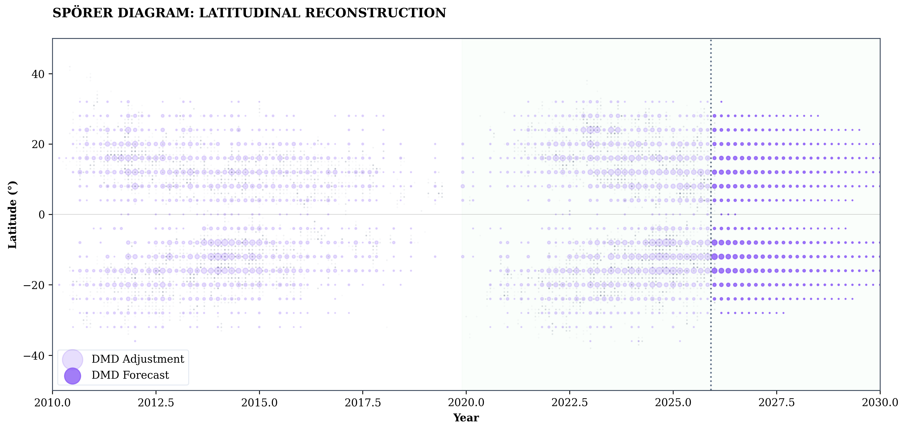
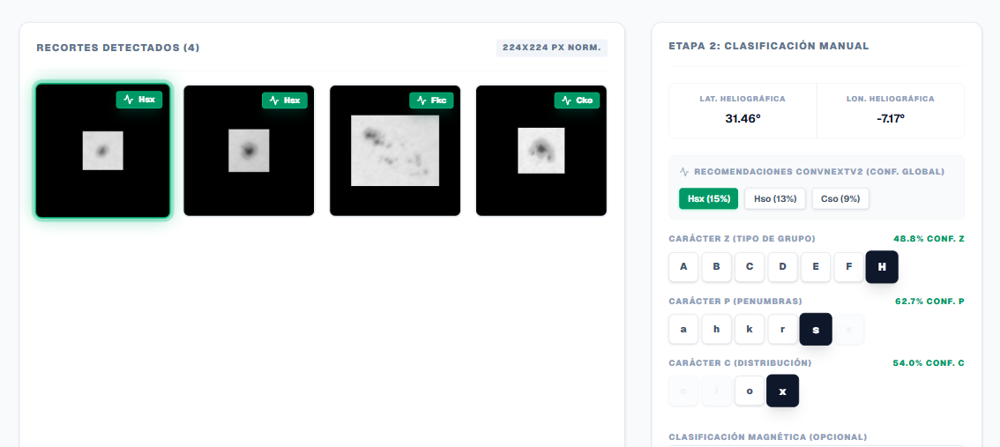
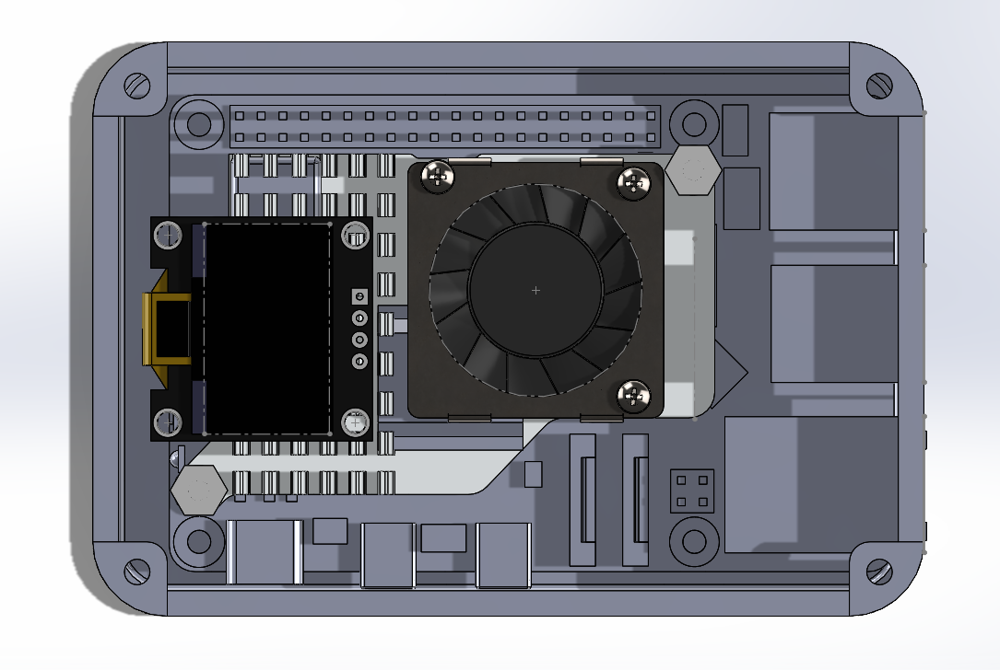

# Sunspot Analysis & Prediction Platform

> **A Functional Prototype for Local Processing, Detection, Classification, and Predictive Analysis of Sunspots using Computer Vision and Artificial Intelligence.**

This project develops a complete processing pipeline that integrates solar image acquisition, metadata logging, database synchronization, on-device inference, and web-based visualization. It is designed to enable traceable, portable, and interpretable solar observations in local academic observatories using a Raspberry Pi 5.

## 🚀 Key Features

*   **Active Region Detection:** Utilizes **YOLO26n** to detect and group solar active regions, providing precise bounding boxes for further analysis.
*   **Hierarchical Morphological Classification:** Employs a **ConvNeXtV2 Atto** based model for Zurich-McIntosh classification. The architecture preserves the semantic dependencies among the $Z$, $P$, and $C$ components, offering interpretable probabilistic recommendations.
*   **Predictive Modeling:**
    *   **PVL-Kalman Filter:** Estimates and smooths the global sunspot number (SSN) over time.
    *   **Dynamic Mode Decomposition (DMD):** Reconstructs and predicts the latitudinal distribution of solar activity (Spörer diagram), providing a spatio-temporal perspective of the solar cycle.
*   **Portable Web Platform:** Runs inference directly in the browser via ONNX Runtime (WASM), minimizing reliance on central servers and facilitating offline or low-connectivity operations.

---

## 📊 Methodology & Results

The system's performance is validated across multiple stages, from machine learning metrics to end-to-end hardware testing.

### 1. Solar Group Detection (YOLO26n)
The detection stage efficiently localizes solar groups, generating consistent crops that feed into the classification pipeline.

### 2. Zurich-McIntosh Hierarchical Classification
Instead of flattening the taxonomy into a single class, the ConvNeXtV2 architecture infers the $Z$, $P$, and $C$ probabilities hierarchically, ensuring astronomical consistency in its predictions.

This structure is translated into a Bayesian probability tree that limits predictions to valid Zurich-McIntosh combinations.

### 3. Predictive Models
**Sunspot Number Tracking (PVL-Kalman):**
Captures the amplitude of the solar cycle, providing a robust scalar metric.

**Latitudinal Migration (DMD):**
Analyzes the spatial progression of sunspots towards the equator over time, commonly known as the Spörer diagram.

### 4. Web Platform & On-Device Inference
The web platform allows users to fetch data from Supabase and run the ONNX models directly in the browser.

---

## ⚙️ Hardware Setup
The prototype was successfully tested in field conditions using:
*   **Raspberry Pi 5** (Local processing node)
*   **ZWO ASI Camera** & **Herschel Wedge**
*   **Supabase** for cloud synchronization

### Enclosure Design
A custom 3D-printed enclosure was designed to protect the Raspberry Pi and accommodate active cooling for sustained outdoor observation.

*For more details on the theoretical framework and implementation, refer to the full document in the `latex` directory.*
